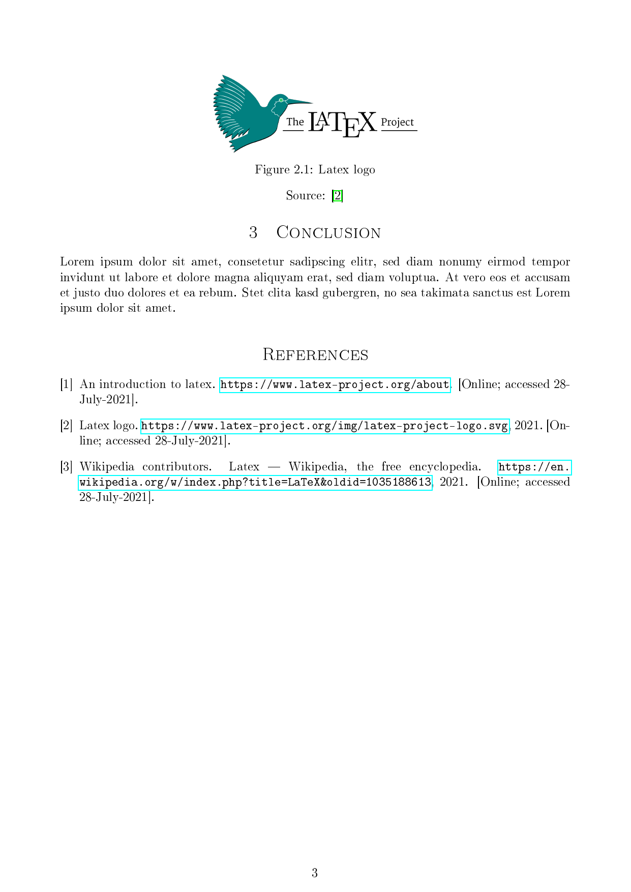

# Latex template

[](https://github.com/daniel-vera-g/latex-template/actions/workflows/compile.yml)
[](https://github.com/daniel-vera-g/latex-template/actions/workflows/form.yml)

> Simple latex project powered by GitHub actions

|  |  |
| ------------------------------------------------------------ | ------------------------------------------------------------ |
|  |  |

## Get started

So you want to use this template? Just a few steps to go:

1. Click `Use this Template`
2. Set your data in `./templates/cover.tex` and add your content in `./main.tex`
3. Optionally: To automatically push the generated PDF and update the images above uncomment the parts in
   `./.github/workflows/compile.yml` and set your GitHub username.

🚀

## Structure

```markdown
├── dict.txt 👉 **Dictionary file for the spell checking(TexTidote)**
└── .textidote 👉 **Spell and linting config(Still beta ;-) )**
├── .github 👉 **GitHub actions automation**
├── img 👉 **Image folder**
├── main.tex 👉 **Your content here**
├── references 👉 **Your BibTex references here**
├── templates 👉 **Your templates here. F.ex cover, structure, packages,...**
```

## Running

> Requirements:
> Everything tested on Ubuntu 18.04 with texlive.
>
> 1. `latexmk` for easy compilation and `chktex` for linting. They're normally already in your LaTeX distribution
> 2. [OPTIONAL]: `pdftoppm` to generate images of your PDF
> 3. [OPTIONAL]: `TexTidote` to check grammar, spelling and a little bit of linting

You can use the `Makefile` when using this template:

- See the [latexmk](https://mg.readthedocs.io/latexmk.html) to learn more about it.

1. `make`: Compile PDF
2. `make clean`: Clean generated tmp files
3. `make cleanall`: Clean _all_ generated files. Also `.pdf`, `.bbl`,...
4. `make watch`: Start compilation in watch mode. Useful for writing
5. `make open`: Open the generated PDF in your PDF viewer

Optional:

- See the [TexTiDote](https://github.com/sylvainhalle/textidote) and [chktex](https://www.nongnu.org/chktex/ChkTeX.pdf) docs to learn more about them.

1. `make images`: Generate images from PDF pages
2. `make lint`: Lint LaTeX file for errors with chktex
3. `make spellcheck`: Do some spell/grammar checking and light linting with TexTiDote

## Automation

This template comes with a GitHub actions automation:

1. Compile project
2. Check errors(`chktex`)
3. Check Grammer and spelling(`textidote`)
4. Optionally: Push updated PDF to repo and update images in README. For this, comment out and adapt the parts in
   `./.github/workflows/compile.yml`

## Helpful tools

- Table generator: <https://www.tablesgenerator.com/>
- References: <https://zbib.org/>
- Diagramms: <https://draw.io/> or <https://plus.excalidraw.com/>
- Vim plugins:
  - Latex support: <https://github.com/lervag/vimtex>
  - Snippets: <https://github.com/SirVer/ultisnips> with <https://github.com/honza/vim-snippets>
- Cheat sheet: <https://wch.github.io/latexsheet/latexsheet.pdf>
